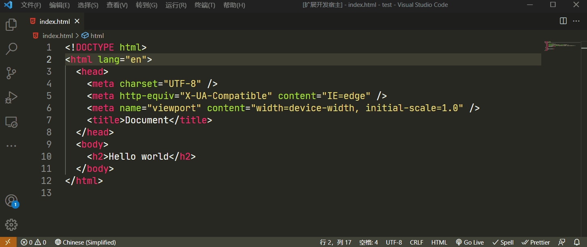

## 发送邮件

邮件格式比较特殊，在编写邮件模板后可以快速测试。支持 html 和 text 两种格式。



## 发送邮件配置

setting.json 中配置主机、端口、用户名、密码、发送人、主题等信息

```json
{
  "emailConfig": {
    "host": "smtp.qq.com",
    "port": 465,
    "auth": {
      "user": "xxx",
      "pass": "xxx"
    },
    "to": "xxx",
    "subject": "xxx"
  }
}
```

## issues

使用中遇到问题可以在这里提问。

[https://github.com/binkzhou/vscode-email/issues](https://github.com/maixiaojie/git-emoji-zh/issues)

## sources

插件源码，沟通交流在这里。

[https://github.com/binkzhou/vscode-email](https://github.com/binkzhou/vscode-email)
